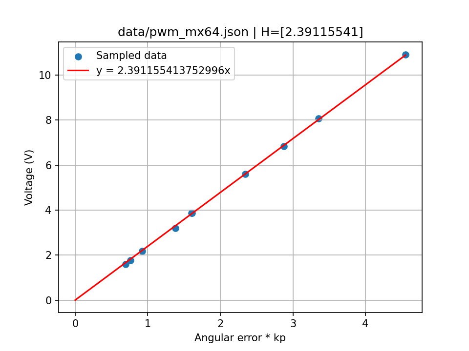
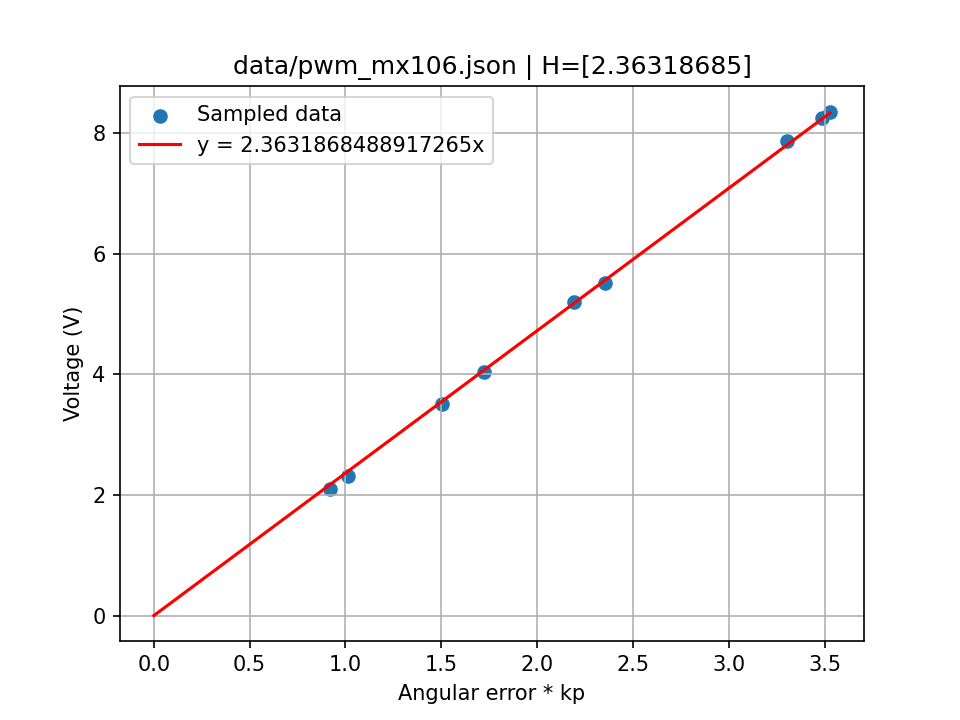

# Dynamixel identification

* $V$ is the voltage applied to the motor in V,
* $I$ is the motor current in A,
* $k_t$ is the motor torque constant in Nm/A, or alternatively in V/(rad/s),
* $\omega$ is the motor angular velocity in rad/s,
* $R$ is the motor resistance in ohms,
* $k_p$ is the Dynamixel P gain in [firmware error unit]/rad,
* $f_s$ is the static friction in Nm,
* $f_v$ is the viscous friction in Nm/(rad/s),
* $H$ is a multiplier to obtain volts in duty/[firmware error unit],
* $G$ is the gear ratio (multiplying torque), 200 for MX-64 and 225 for MX-106.
  (**Note:** this can be simplified in all the below equations since all measures are made at the joint level).

| Motor           | MX-64           | MX-106          | Unit            |
|-----------------|-----------------|-----------------|-----------------|
| $R$             | 2.1             | 2.3             | ohms            |
| $k_t$           | ?               | ?               | Nm/A            |
| $f_s$           | ?               | 0.212           | Nm              |
| $f_v$           | ?               | ?               | Nm/(rad/s)      |
| $H$             | 0.15941036      | 0.15754579      | duty/[firmware error unit] |

## Equations

### Motor equations

See Modern Robotics, section 8.9.1.

$$\tau = k_t I $$

$$\omega = \frac{V}{k_t} - \frac{R}{k_t} I$$

$$\omega = \frac{V}{k_t} - \frac{R}{k_t^2} \tau$$

$$\tau = \frac{k_t}{R} V - \frac{k_t^2}{R} \omega$$

### Motor reduction ratio

If we note $\tau^m, \omega^m$ $k_t^m$ the torque, velocity and motor constant at the motor level, we have:

* $\tau = G \tau^m$
* $\omega = \frac{1}{G} \omega^m$
* $k_t = G k_t^m$

With $\tau, \omega$ and $k_t$ the equivalent at the joint level (after the reduction is applied). The motor equation:

$$\omega^m = \frac{V}{k_t^m} - \frac{R}{{k_t^m}^2} \tau^m$$

Then becomes:

$$G \omega = \frac{G V}{k_t} - \frac{G R}{{k_t}^2} \tau$$

That can be simplified to:

$$\omega = \frac{V}{k_t} - \frac{R}{{k_t}^2} \tau$$

### Control equation

A single P was used

$$V = V_{in} H k_p (\theta^d - \theta)$$

### Values to MuJoCo

To use those values in MuJoCo:

* `kp`: $\frac{k_t k_p H V_{in}}{R}$
* `damping`: $\frac{k_t^2}{R} + f_v$
* `frictionloss`: $f_s$

## Measuring $f_s$

We added a load of mass $m$ on the motor, with a lever arm of length $l$.
We let the arm fall until it reach an angle $\theta$ (0 being the arm horizontal).
We can then estimate $f_s$ with:

$$f_s = m g l \cos(\theta)$$

### MX-64

**TODO**

### MX-106

$f_s = 0.212$ Nm

* $m = 0.330$ kg
* $l = 0.150$ m
* $\theta \approx 64$ deg

## Measuring $R$

Here are multimeter measures, they will be improved in the future.

### MX-64

$R = 2.1$ ohms

### MX-106

$R = 2.3$ ohms

## Measuring $k_t$

To measure $k_t$, a known load was applied to the motor, and the voltage required to maintain the motor static was measured.
The torque applied by the motor is then:

$\tau^{load} = f_s + \tau$

Since $\omega = 0$, we have:

$$\tau = \frac{k_t}{R} V$$

We can then estimate $k_t$ with:

$$
k_t = (\tau^{load} - f_s) \frac{R}{V}
$$

## MX-64

**TODO**

## MX-106

**TODO**

## No-load speed vs voltage$

We measured the no load speed for various velocities. For this, we used `velocity.py`.

**TODO**: After we estimate $R$, $k_t$, and $f_s$, we can estimate $f_v$ using those data.

## Measuring $H$

To measure $H$, we gave targets and measured the output voltage using an oscilloscope.

### MX-64
 
* $H = 0.15941036$

### MX-106

* $H = 0.15754579$

