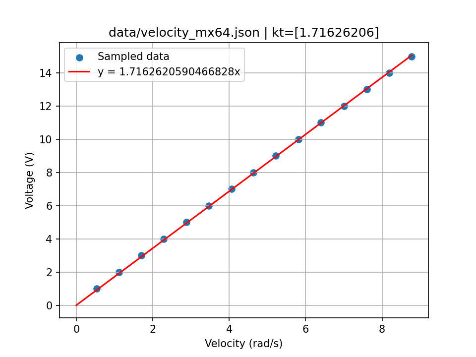
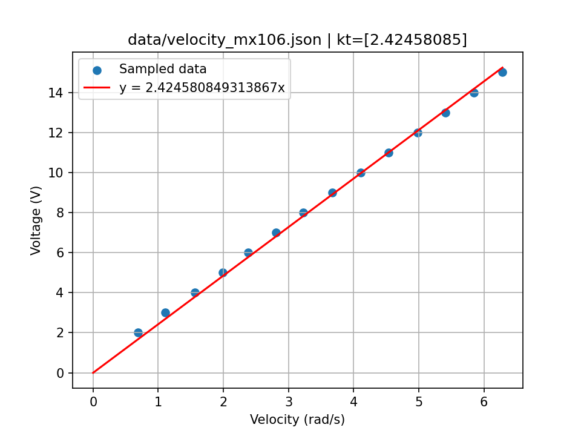

# Dynamixel identification

* $V$ is the voltage applied to the motor in V,
* $I$ is the motor current in A,
* $k_t$ is the motor torque constant in Nm/A, or alternatively in V/(rad/s),
* $\omega$ is the motor angular velocity in rad/s,
* $R$ is the motor resistance in ohms,
* $k_p$ is the Dynamixel P gain in [firmware error unit]/rad,
* $H$ is a multiplier to obtain volts in volts/[firmware error unit],
* $G$ is the gear ratio (multiplying torque), 200 for MX-64 and 225 for MX-106.
  (**Note:** this can be simplified in all the below equations since all measures are made at the joint level).

| Motor           | MX-64           | MX-106          | Unit            |
|-----------------|-----------------|-----------------|-----------------|
| $R$             | ?               | ?               | ohms            |
| $k_t$           | 1.71626206      | 2.42458085      | Nm/A            |
| $H$             | 2.39115541      | 2.36318685      | V/[firmware error unit] |

## Equations

### Motor equations

See Modern Robotics, section 8.9.1.

$$\tau = k_t I $$

$$\omega = \frac{V}{k_t} - \frac{R}{k_t^2} \tau$$

$$\tau = \frac{k_t}{R} V - \frac{k_t^2}{R} \omega$$

### Motor reduction ratio

If we note $\tau^m, \omega^m$ $k_t^m$ the torque, velocity and motor constant at the motor level, we have:

* $\tau = G \tau^m$
* $\omega = \frac{1}{G} \omega^m$
* $k_t = G k_t^m$

With $\tau, \omega$ and $k_t$ the equivalent at the joint level (after the reduction is applied). The motor equation:

$$\omega^m = \frac{V}{k_t^m} - \frac{R}{{k_t^m}^2} \tau^m$$

Then becomes:

$$G \omega = \frac{G V}{k_t} - \frac{G R}{{k_t}^2} \tau$$

That can be simplified to:

$$\omega = \frac{V}{k_t} - \frac{R}{{k_t}^2} \tau$$

### Control equation

A single P was used

$$V = H k_p (\theta^d - \theta)$$

### Values to MuJoCo

To use those values in MuJoCo:

* `kp`: $\frac{k_t H k_p}{R}$
* `damping`: $\frac{k_t^2}{R}$

## Measuring $R$

Here are multimeter measures, they will be improved in the future.

### MX-64

$R = 2.4$

### MX-106

$R = 2.5$

## Measuring $k_t$

To measure $k_t$, we applied known voltages to the motors while measuring velocities from the encoder (using `velocity.py`). The resulting JSON files (`velocity_*.json`) can then be used to estimate $k_t$.

Estimation can be done using `estimate_kt.py`.

### MX-64

$k_t = 1.71626206$

### MX-106

$k_t = 2.42458085$

## Measuring $H$

To measure $H$, we gave targets and measured the output voltage using an oscilloscope.

### MX-64
 
* $H = 2.39115541$

### MX-106

* $H = 2.36318685$

