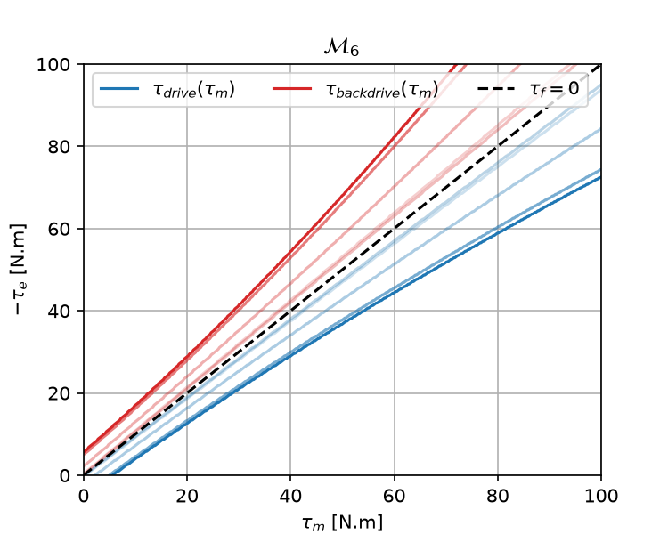
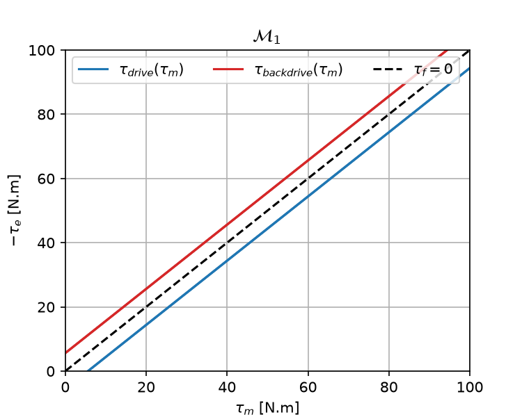
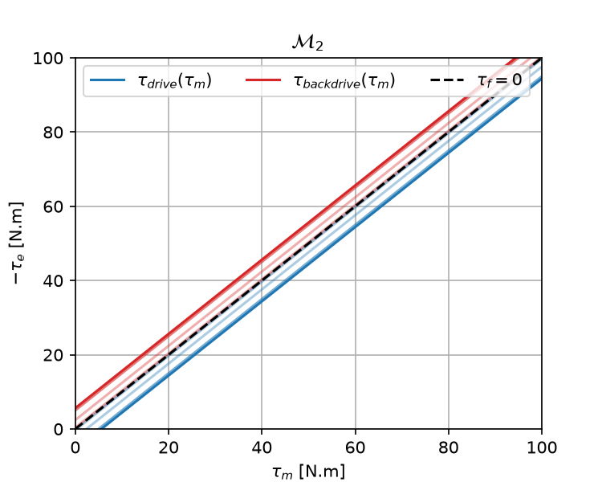
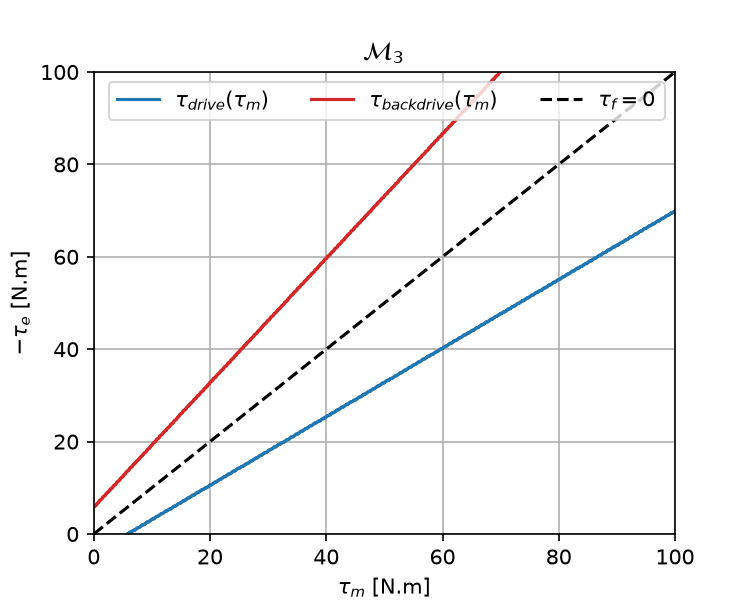
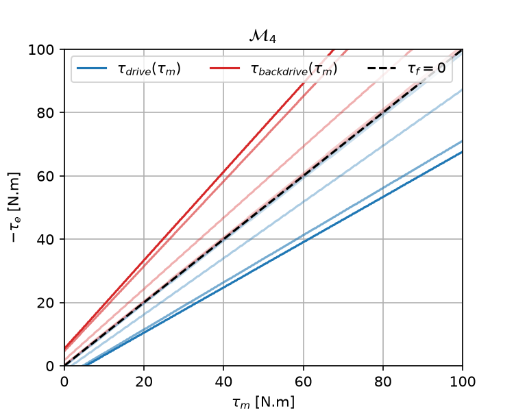
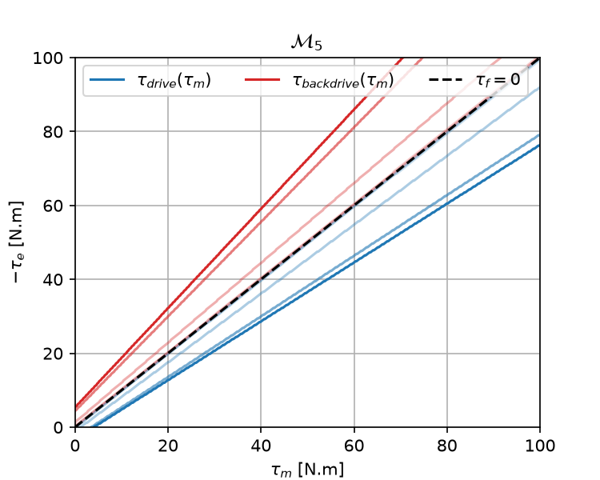

Friction Models (M1-M6)
=======================

BAM supports six friction models of increasing expressiveness, denoted
:math:`\mathcal{M}_1` to :math:`\mathcal{M}_6`.

They are ordered from the simplest Coulomb-Viscous approximation to a richer
directional and quadratic formulation that better captures gearbox behavior.

- :math:`\mathcal{M}_1`: Coulomb-Viscous
- :math:`\mathcal{M}_2`: Stribeck
- :math:`\mathcal{M}_3`: Load-dependent
- :math:`\mathcal{M}_4`: Stribeck + load-dependent
- :math:`\mathcal{M}_5`: Directional load-dependent
- :math:`\mathcal{M}_6`: Quadratic directional variant

Notation
--------

In the equations below:

- :math:`\dot{\theta}` is joint velocity
- :math:`\tau_m` is motor torque
- :math:`\tau_e` is external/load torque
- :math:`\tau_{fm}` is the maximum resistive friction torque (friction budget)

The simulation then applies friction by clipping the stopping torque in
:math:`[-\tau_{fm},\tau_{fm}]`.

Drive/backdrive diagrams
------------------------

The drive/backdrive diagrams help to visualize the effect of friction. Let's for example consider the :math:`\mathcal{M}_6` model:

Here:

- Below the blue line, the motor is driving the system
- Above the red line, the system is backdriving the motor
- On the black dashed line, motor torque and external torque exacttly cancel out
- In the middle, the friction budget is preventing motion in the system
- The lines with less opacity depicts what happens when the system is moving (1 rad/s per step). As you can notice, the faster the system is moving, the less friction appears here.

They can be obtained using ``bam.drive_backdrive`` command from the repository:

.. code-block:: bash

    uv run -m bam.drive_backdrive --params bam/params/erob80_100/m1.json  --max_torque 100

Model :math:`\mathcal{M}_1`: Coulomb-Viscous
--------------------------------------------

.. math::

   \mathcal{M}_1:\quad
   \tau_{fm} = K_v|\dot{\theta}| + K_c

This is the baseline model used in most physics simulators.
It keeps only viscous damping and a constant Coulomb term.

Model :math:`\mathcal{M}_2`: Stribeck
-------------------------------------

.. math::

   \mathcal{M}_2:\quad
   \tau_{fm} = K_v|\dot{\theta}| + K_c +
   \exp\left(-\left|\frac{\dot{\theta}}{\dot{\theta}_s}\right|^{\alpha}\right)K_{cs}

This adds higher friction near zero speed and smooth transition to sliding.
It models the fact that static friction is usually stronger than sliding friction.

Model :math:`\mathcal{M}_3`: Load-dependent
-------------------------------------------

.. math::

   \mathcal{M}_3:\quad
   \tau_{fm} = K_v|\dot{\theta}| + K_c + K_l|\tau_m - \tau_e|

This captures the increase of friction with transmitted gearbox load.
It is useful when the apparent resistance depends on how hard the transmission is loaded.

Model :math:`\mathcal{M}_4`: Stribeck + load-dependent
------------------------------------------------------

.. math::

   \mathcal{M}_4:\quad
   \tau_{fm} = K_v|\dot{\theta}| + K_c + K_l|\tau_m-\tau_e|
   + \exp\left(-\left|\frac{\dot{\theta}}{\dot{\theta}_s}\right|^{\alpha}\right)
   \left(K_{cs} + K_{ls}|\tau_m-\tau_e|\right)

This combines presliding dynamics with load dependence.
It adds Stribeck smoothing on top of a load-sensitive friction budget.

Model :math:`\mathcal{M}_5`: Directional load-dependent
-------------------------------------------------------

.. math::

   \mathcal{M}_5:\quad
   \tau_{fm} = K_v|\dot{\theta}| + K_c + |K_m\tau_m - K_e\tau_e|
   + \exp\left(-\left|\frac{\dot{\theta}}{\dot{\theta}_s}\right|^{\alpha}\right)
   \left(K_{cs} + |K_{ms}\tau_m - K_{es}\tau_e|\right)

This separates motor-side and external-side contributions, which helps model
directional efficiency/backdrivability asymmetry.
It is appropriate when the gearbox behaves differently depending on the torque direction.

Model :math:`\mathcal{M}_6`: Quadratic directional
--------------------------------------------------

.. math::

   \mathcal{M}_6:\quad
   \tau_{fm} = K_v|\dot{\theta}| + K_c + |K_m\tau_m - K_e\tau_e|
   + \exp\left(-\left|\frac{\dot{\theta}}{\dot{\theta}_s}\right|^{\alpha}\right)
   \left(K_{cs} + |K_{ms}\tau_m - K_{es}\tau_e| + Q\right)

with piecewise quadratic contribution:

.. math::

   Q =
   \begin{cases}
   K_{eq}\tau_e^2 & \text{if } |\tau_m| > |\tau_e| \\
   K_{mq}\tau_m^2 & \text{otherwise}
   \end{cases}

This is useful for actuators where harmonic-drive-like effects create nonlinear
load-friction coupling.
It extends the directional model with a quadratic load term.

Modeling hierarchy
------------------

The sequence :math:`\mathcal{M}_1 \rightarrow \mathcal{M}_6` reflects increasing
expressiveness and parameter count. In practice, BAM fits all candidates and
selects the best trade-off from validation error.

Implementation in BAM
---------------------

Model behaviors are implemented in :mod:`bam.model`, notably:

- :class:`bam.model.Model`
- :func:`bam.model.load_model`
- :func:`bam.model.load_model_from_dict`
